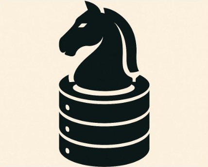

<h1 align="center">Knightshift: Chess Analytics Pipeline</h1>

<p align="center">
  Turn live Lichess games into structured, analytics-ready records — orchestrated with Airflow.
</p>


<p align="center"><b>▷ See It in Action (2-min demo)</b></p>

<p align="center">
  <a href="https://youtu.be/CAupEMTL6uY">
    
  </a>
</p>

---

## How It Works

**Ingest:** stream live games from Lichess TV channels (blitz, rapid, horde).  
**Parse:** convert PGN chess notation into structured records.  
**Transform:** extract player names, ratings, results, time controls, and metadata.  
**Store:** upsert into PostgreSQL with SQLAlchemy Core, maintaining clean and deduplicated tables.  
**Protect:** load credentials securely from AWS Secrets Manager or local `.env`.


## Key Features

| Capability | What you get |
|------------|--------------|
| Streaming ingestion | Live games pulled from multiple Lichess TV feeds |
| PGN parsing & schema | Move-by-move chess data structured into relational form |
| Upserts & deduplication | SQLAlchemy logic ensures clean, reproducible tables |
| Secrets management | Credentials from AWS Secrets Manager or `.env` |
| Airflow orchestration | Optional DAGs schedule ingestion and monitoring |


## Run It Yourself

### Quickstart (Local Python)

1. Provision a PostgreSQL database and store credentials in AWS Secrets Manager (or a local `.env`).

2. Install dependencies:

   ```
   pip install -r requirements.txt
   ```

3. Run the pipeline:

   ```
   python main.py
   ```

The pipeline fetches games every 40 seconds for 5 hours and writes them to Postgres.


### Orchestrated Setup (Docker Compose + Airflow)

Knightshift can also run as a full stack with Postgres, Airflow, and the ingestion worker via docker compose.
See [infra/README.md](infra/README.md) for instructions, including restoring Grafana dashboards and managing secrets.


### Project Layout

```
knightshift/
├── airflow/
│   ├── dags/                   # Airflow DAGs
│   ├── logs/                   # Task and execution logs
│   ├── plugins/                # Airflow custom plugins
├── annotations/                # Annotations and exploration docs
├── backups/                    # Backup logs and files
├── config/                     # Configuration files
├── docs/                       # Documentation (e.g., changelogs, architecture)
├── explorations/               # Exploration of data models (e.g., NoSQL, Graph)
├── infra/                      # Infrastructure configuration (Docker, Compose)
├── knightshift/                # Core pipeline scripts (ingestion, cleaning, enrichment)
├── logs/                       # Pipeline logs
├── schemas/                    # Database schemas and migrations
└── scripts/                    # Utility scripts (e.g., run scripts)
```


### Code Snippet: Expected Secret Format

```json
{
  "PGHOST": "your-db-host",
  "PGPORT": "5432",
  "PGDATABASE": "your-db-name",
  "PGUSER": "your-username",
  "PGPASSWORD": "your-password"
}
```


### Tech Stack

- Python 3.10+
- PostgreSQL
- SQLAlchemy Core
- AWS Secrets Manager (`boto3`)
- Requests (API interaction)

---

<p align="center">
  <a href="https://github.com/moveeleven-data/knightshift/actions/workflows/main.yml">
    
  </a>
</p>
